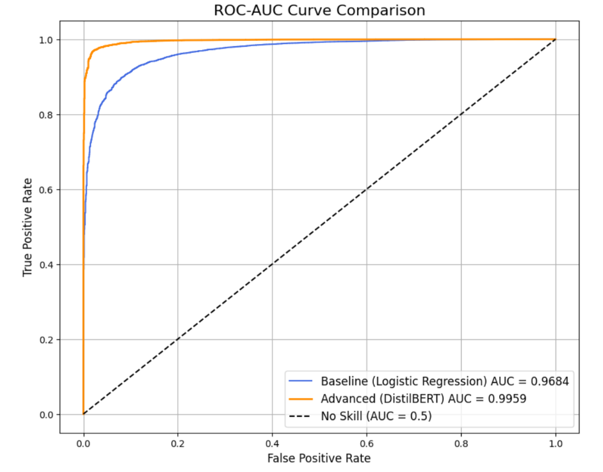
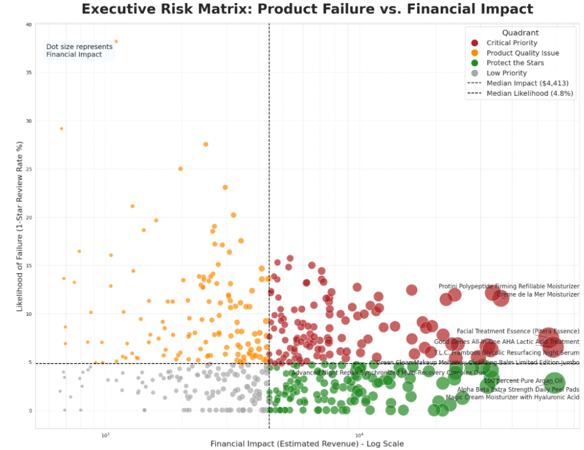
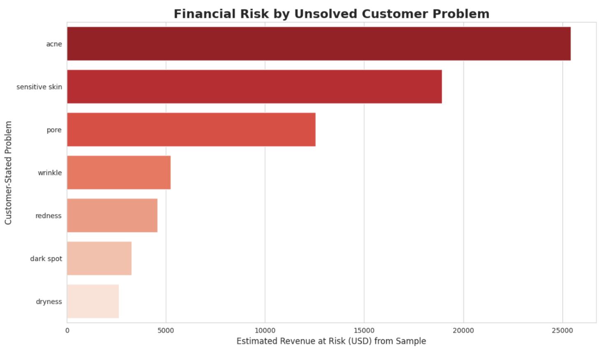
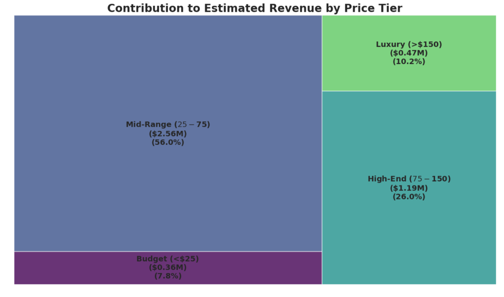
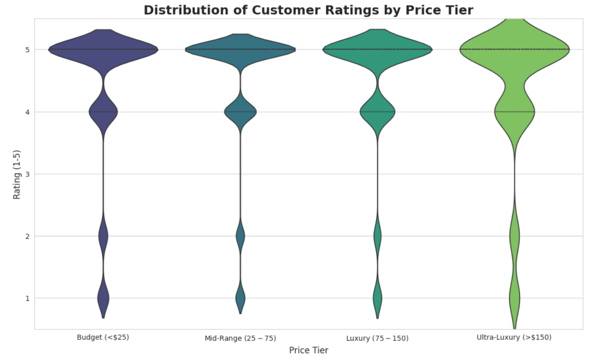
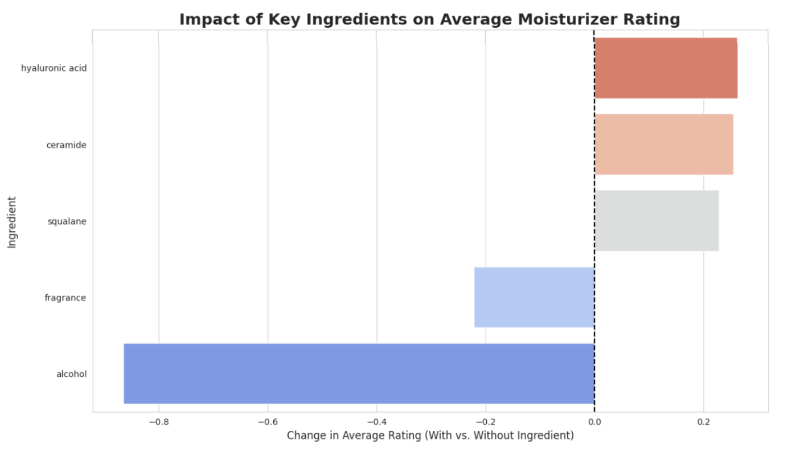

# Sephora Product Risk Mitigation via NLP Sentiment Analysis

A deep dive into 100,000+ customer reviews to quantify financial risk and drive business strategy using a state-of-the-art DistilBERT model.

[](https://colab.research.google.com/drive/1IMYbFHT8p9AoAuWaknkLcxCAtO5Cp-Mf?usp=sharing)

---

## Quick Navigation

- [Project Overview](#-project-overview)
- [Tech Stack](#️-tech-stack)
- [Methodology](#-methodology)
- [Model Performance](#-model-performance)
  - [Model Validation (Sanity Checks)](#model-validation-sanity-checks)
- [Key Findings & Actionable Insights](#-key-findings--actionable-insights)
  - [1. Strategic Risk Matrix](#1-strategic-risk-matrix-diagnosing-product-failures)
  - [2. Financial Risk by Customer Concerns](#2-financial-risk-by-customer-concerns)
  - [3. The Financial Engine](#3-the-financial-engine-mid-range-is-the-market-leader)
  - [4. The Myth of Price vs. Quality](#4-the-myth-of-price-vs-quality-is-busted)
  - [5. Ingredient Connection](#5-ingredient-connection-data-driven-formulation)
- [How to Run This Project](#-how-to-run-this-project)

---

## Project Overview

This project transforms unstructured Sephora customer reviews into a powerful strategic asset. The primary objective was to move beyond simple star ratings and use Natural Language Processing (NLP) to understand the *why* behind customer satisfaction and dissatisfaction.

By building a high-performance sentiment classification model, this analysis quantifies product risk, uncovers key drivers of customer sentiment, and provides a series of data-driven recommendations for Marketing, R&D, and Product teams.

---

## Tech Stack


---

## Methodology

1.  **Data Ingestion & Cleaning:** Loaded and merged multiple datasets, then performed rigorous text preprocessing (lemmatization, stopword removal) to create a clean corpus for the baseline model.
2.  **Baseline vs. Advanced Modeling:**
    * Established a **Logistic Regression** baseline with TF-IDF features to diagnose the problem as **underfitting** (F1-score: 0.70).
    * Engineered a solution by fine-tuning a **DistilBERT** transformer model, which successfully captured the text's complexity.
3.  **Deep-Dive Analysis:** Used the validated model and cleaned data to conduct a series of strategic deep dives into the drivers of business value and risk.

---

## 🤖 Model Performance

The fine-tuned **DistilBERT** model achieved state-of-the-art performance, confirming it was the right solution to overcome the baseline's underfitting.

-   **Accuracy:** **98%**
-   **AUC Score:** **0.99**
-   **Weighted F1-Score:** **0.98**
-   **Negative Class F1-Score:** **0.92** 



### Model Validation (Sanity Checks)

A model this accurate requires rigorous validation.
1.  **Stability Check:** Re-trained the model on a **new 80/20 split** with a different random seed, achieving nearly identical performance. This proves the model is **stable** and the result is not a "lucky" fluke.
2.  **Qualitative Error Analysis:** Manually reviewed the model's most confident mistakes. This revealed that the model was failing not on simple text, but on **complex sarcasm** or **mislabeled data** (e.g., a 1-star rating with "I love this!" text), proving its deep understanding of language.

---

## Key Findings & Actionable Insights

### 1. Strategic Risk Matrix: Diagnosing Product Failures
-   **Observation:** Products were plotted by their **Failure Rate (1-Star %)** vs. their **Financial Impact (Est. Revenue)**. This revealed two critical, high-risk quadrants.
-   **Actionable Insight:** This matrix is a direct roadmap for resource allocation.
    -   **"Critical Priority"** products (high-failure, high-revenue) are an urgent **R&D and Quality Control** issue.
    -   **"Segment Failures"** (high-failure, high-variance) are a **Marketing & Personalization** problem, as they are being sold to the wrong customer segments.



---

### 2. Financial Risk by Customer Concerns
-   **Observation:** By calculating a "Revenue at Risk" proxy, we quantified the financial damage from unsolved customer problems. Unresolved **"acne"** issues are the **#1 largest financial risk** in our sample, representing over **$25,000** in at-risk revenue.
-   **Actionable Insight:** This is a clear directive for **R&D and Product Acquisition**. The highest-priority business need is a "holy grail" product line for acne, as this represents the single biggest opportunity to reduce financial risk.



---

### 3. The Financial Engine: Mid-Range is the Market Leader
-   **Observation:** The **Mid-Range price tier ($25-$75)** is the undisputed core of the business, driving over **55% of total estimated revenue**.
-   **Actionable Insight:** The Mid-Range tier is Sephora's strategic center of gravity. It demands the highest priority in **marketing campaigns, inventory management, and customer acquisition** strategies.



---

### 4. The Myth of Price vs. Quality is Busted
-   **Observation:** Price has **near-zero correlation** with customer satisfaction. The rating distributions are nearly identical across all four price tiers, from Budget to Ultra-Luxury.
-   **Actionable Insight:** **Marketing** must stop using "premium price" as a proxy for "quality." All campaigns should focus on tangible benefits, proven ingredients, and problem-solving, as this is what drives customer satisfaction.



---

### 5. Ingredient Connection: Data-Driven Formulation
-   **Observation:** Specific ingredients are clear drivers of customer sentiment.
    -   **"Hero" Ingredients:** Hyaluronic Acid, Ceramides, and Squalane correlate with *higher* ratings.
    -   **"Villain" Ingredient:** Alcohol correlates with a significant *drop* in ratings.
-   **Actionable Insight:** A clear guide for **R&D**: prioritize "hero" ingredients and eliminate "villain" ingredients in future formulations.



---

## How to Run This Project

1.  **Clone the Repository:**
    ```bash
    git clone [https://github.com/VivoSorhie/Sephora-Reviews-Sentiment-Analysis.git](https://github.com/VivoSorhie/Sephora-Reviews-Sentiment-Analysis.git)
    ```
2.  **Install Dependencies:**
    ```bash
    pip install pandas numpy matplotlib seaborn scikit-learn torch transformers datasets squarify
    ```
3.  **Run the Notebook:**
    -   Open the `sephora_sentiment_analysis.ipynb` file in Google Colab or a local Jupyter environment.
    -   You will be prompted to upload the `sephora_sample_data.csv` file at the beginning.
    -   Run the cells sequentially to reproduce the analysis.
